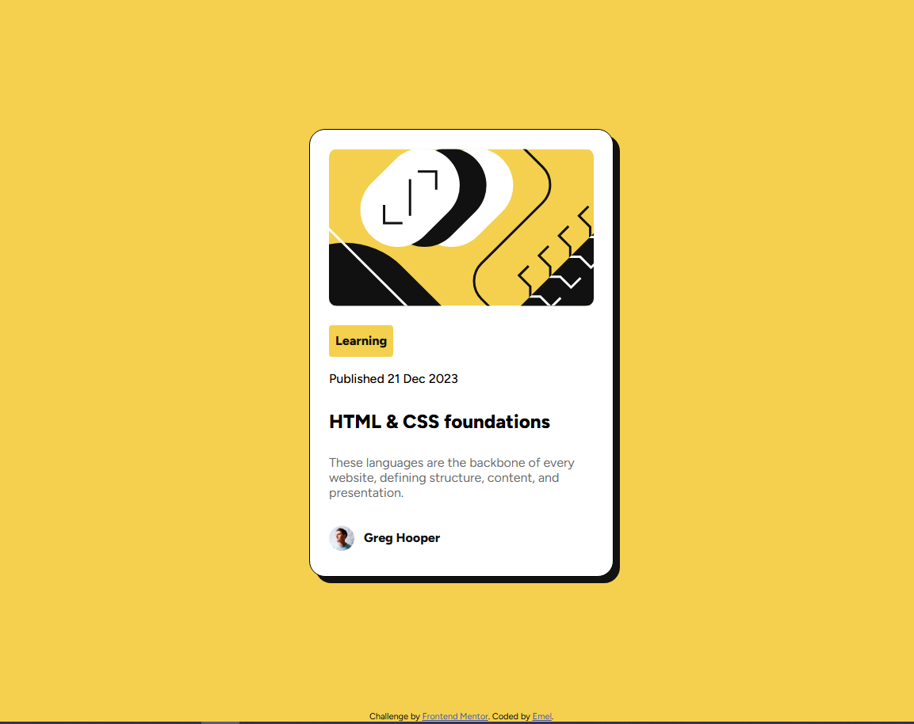

# Frontend Mentor - Blog preview card


## Welcome! 👋

This is a solution to the [Blog preview card challenge on Frontend Mentor](https://www.frontendmentor.io/challenges/blog-preview-card-ckPaj01IcS).  
Frontend Mentor challenges help you improve your coding skills by building realistic projects.  

## Overview

### Screenshot


### Links
- Solution URL: [Add solution URL here](https://www.frontendmentor.io/solutions/blog-preview-card-main-qpc0Rua0FG)  
- Live Site URL: [Add live site URL here](https://emelinur.github.io/blog-preview-card-main/)

## My process

### Built with
- Semantic HTML5 markup  
- CSS custom properties (`:root`)  
- Flexbox  
- CSS Grid (if used)  
- Mobile-first workflow  

### What I learned
In this project I learned and practiced:
- How to use `@media` queries for responsive design (327px mobile, 384px desktop).  
- How to use the `gap` property in Flexbox for cleaner spacing.  
- Reinforced my understanding of `flex: 1`.  
- The importance of defining a design system with `:root` variables for spacing, colors, and typography.  

```css
.card-content {
  display: flex;
  flex-direction: column;
  gap: var(--space-150); /* 12px */
}

**Have fun building!** 🚀
